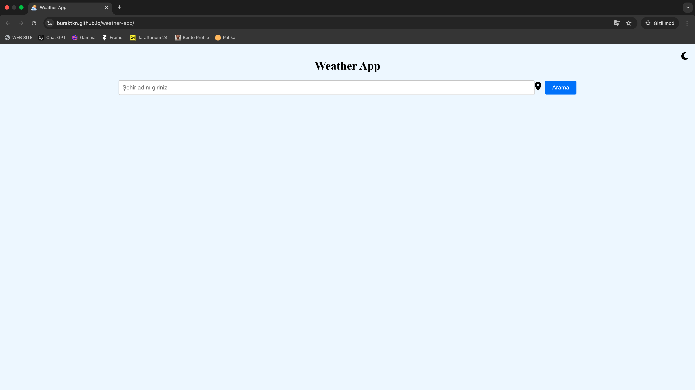
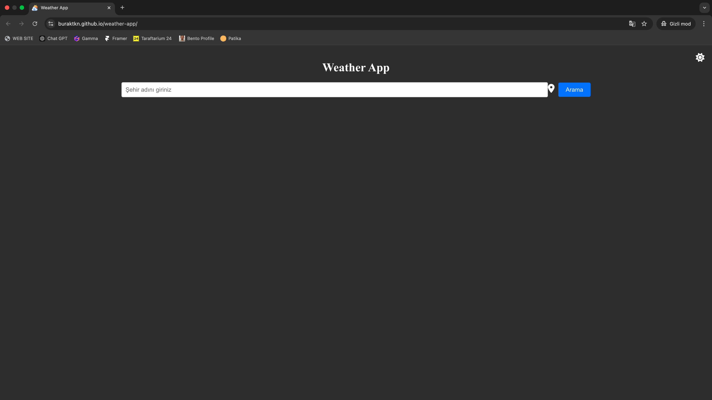

# **Weather App**

Bu proje, React ve OpenWeather API kullanılarak geliştirilmiş bir hava durumu uygulamasıdır. Kullanıcılar şehir adı girerek hava durumunu öğrenebilir ve ek detayları görüntüleyebilir.




---

## **Özellikler**

- 📍 **Şehir Arama:** İstediğiniz şehrin anlık hava durumunu öğrenin.
- 🌡️ **Hava Durumu Detayları:** 
  - Sıcaklık, hissedilen sıcaklık.
  - Nem oranı, rüzgar hızı.
  - Bulutluluk oranı, görüş mesafesi.
  - Gün doğumu ve gün batımı saatleri.
- 🌗 **Tema Desteği:** Karanlık ve açık mod arasında geçiş yapabilirsiniz.

---

## **Kullanım**

### **Kurulum**
Projeyi klonlayın:
```bash
git clone https://github.com/buraktkn/weather-app.git

```

Uygulamayı çalıştırın:
```bash
npm start
```
